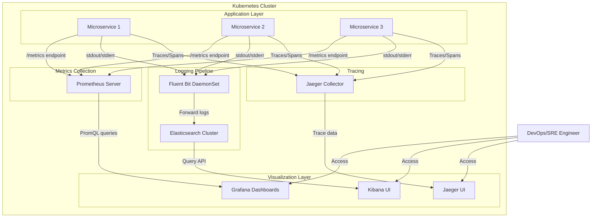

# Observability in DevOps — End-to-End Hands-On Guide

A comprehensive, production-ready guide to implementing complete observability infrastructure in Kubernetes environments. This project demonstrates enterprise-grade monitoring, logging, and tracing using the most widely-adopted open-source tools in the industry.

## Overview

This repository showcases a complete observability stack implementation that addresses real-world challenges in distributed systems. By combining **metrics**, **logs**, and **traces**, this setup provides the visibility needed to maintain, debug, and optimize modern microservices architectures.

### Technology Stack

| Tool | Purpose | Why It Matters |
|------|---------|----------------|
| **Prometheus** | Time-series metrics collection and storage | Industry standard for Kubernetes monitoring, pull-based model |
| **Grafana** | Data visualization and dashboards | Multi-source visualization platform with powerful alerting |
| **Elasticsearch** | Centralized log storage and search | Scalable log aggregation with powerful query capabilities |
| **Fluent Bit** | Lightweight log forwarding | Kubernetes-native, low resource footprint |
| **Kibana** | Log visualization and analysis | Rich UI for exploring and analyzing log data |
| **Jaeger** | Distributed tracing | Identify performance bottlenecks across microservices |
| **OpenTelemetry** | Instrumentation framework | Vendor-neutral standard for telemetry data |

### Project Environment

**Development:** Minikube cluster with Docker driver (local development and testing)

**Production-Ready:** All configurations are adaptable to production environments:
- Amazon EKS (Elastic Kubernetes Service)
- Google GKE (Google Kubernetes Engine)
- Azure AKS (Azure Kubernetes Service)

---

## Table of Contents

- [Architecture Overview](#architecture-overview)
- [Why Observability Matters](#why-observability-matters)
- [Prerequisites](#prerequisites)
- [Step 1: Kubernetes Cluster Setup](#step-1-kubernetes-cluster-setup)
- [Step 2: Metrics with Prometheus & Grafana](#step-2-metrics-with-prometheus--grafana)
- [Step 3: Centralized Logging with EFK](#step-3-centralized-logging-with-efk)
- [Step 4: Distributed Tracing with Jaeger](#step-4-distributed-tracing-with-jaeger)
- [Step 5: OpenTelemetry Demo Application](#step-5-opentelemetry-demo-application)
- [Real-World Scenarios](#real-world-scenarios)
- [Key Learnings](#key-learnings)
- [Next Steps](#next-steps)
- [References](#references)

---

## Architecture Overview



---

## Why Observability Matters

### The Microservices Challenge

Modern applications have evolved from monolithic architectures to distributed microservices. This shift brings significant complexity:

**Monolithic Era:**
- Single codebase, single deployment
- Logs in one location
- Simple debugging: grep logs, check metrics, restart service

**Microservices Reality:**
- 50+ services per application
- Multiple programming languages (Go, Java, Python, Node.js)
- Distributed databases and message queues
- Request flows across 10-15 services
- Network latency between every hop

**Traditional monitoring (CPU, memory, disk, uptime) fails to answer:**
- Why is the checkout process slow for 5% of users?
- Which service is causing the 500 errors?
- Where exactly is the 2-second latency coming from?

### The Three Pillars of Observability

| Pillar | What It Tells You | Technical Implementation | Business Value |
|--------|-------------------|-------------------------|----------------|
| **Metrics** | System health and trends | Time-series data (counters, gauges, histograms) | SLA compliance, capacity planning |
| **Logs** | What happened and why | Structured event records with context | Root cause analysis, debugging |
| **Traces** | Request journey across services | Distributed trace IDs and spans | Performance optimization, bottleneck identification |

### Questions Observability Answers

1. **Is my system healthy?** → Metrics dashboards show real-time health
2. **What went wrong?** → Logs provide detailed error context
3. **Where exactly did it fail?** → Traces pinpoint the failing service
4. **Why did it fail?** → Correlation of metrics, logs, and traces
5. **When did it start?** → Time-series data shows exact timestamps
6. **How can I prevent it?** → Historical analysis reveals patterns

---

## Prerequisites

### Required Knowledge
- Kubernetes fundamentals (Pods, Services, Deployments, Namespaces)
- Docker containerization basics
- YAML configuration
- Basic Linux command line

### Required Tools

```bash
# Verify installations
kubectl version --client
helm version
minikube version
docker --version
```

**Installation guides:**
- [kubectl](https://kubernetes.io/docs/tasks/tools/)
- [Helm 3.x](https://helm.sh/docs/intro/install/)
- [Minikube](https://minikube.sigs.k8s.io/docs/start/)
- [Docker](https://docs.docker.com/get-docker/)

### System Requirements
- **CPU:** 4+ cores
- **RAM:** 8GB minimum, 16GB recommended
- **Disk:** 20GB free space
- **OS:** Linux, macOS, or Windows with WSL2

---

## Step 1: Kubernetes Cluster Setup

### Option A: Minikube (Local Development)

**Why Minikube?**
- Free and runs on your laptop
- Perfect for learning and testing
- Simulates production Kubernetes behavior
- Fast iteration cycles

**Start the Cluster:**

```bash
# Start with adequate resources
minikube start --driver=docker --cpus=4 --memory=8192 --disk-size=20g

# Verify cluster is running
kubectl cluster-info
kubectl get nodes
```

**Expected Output:**
```
NAME       STATUS   ROLES           AGE   VERSION
minikube   Ready    control-plane   1m    v1.27.0
```

**Enable Key Addons:**

```bash
# Enable metrics-server for resource monitoring
minikube addons enable metrics-server

# Enable ingress for external access (optional)
minikube addons enable ingress

# Verify addons
minikube addons list
```

### Option B: Amazon EKS (Production Environment)

**Why EKS?**
- Fully managed Kubernetes control plane
- Seamless AWS integration (IAM, VPC, EBS, ALB)
- Enterprise-grade reliability and security
- Auto-scaling and multi-AZ deployments

**Create EKS Cluster:**

```bash
# Install eksctl (if not already installed)
curl --silent --location "https://github.com/weaveworks/eksctl/releases/latest/download/eksctl_$(uname -s)_amd64.tar.gz" | tar xz -C /tmp
sudo mv /tmp/eksctl /usr/local/bin

# Create cluster (takes ~15 minutes)
eksctl create cluster \
  --name observability-demo \
  --region us-east-1 \
  --nodegroup-name standard-workers \
  --node-type t3.medium \
  --nodes 3 \
  --nodes-min 2 \
  --nodes-max 4 \
  --managed

# Verify connection
kubectl get nodes
```

**Cost Optimization Tips:**
- Use spot instances for non-production workloads
- Set up auto-scaling to scale down during off-hours
- Use t3.medium instances (2 vCPU, 4GB RAM) for testing

---

## Step 2: Metrics with Prometheus & Grafana

### Understanding the Stack

**What Prometheus Does:**
- **Pulls metrics** from applications every 15-30 seconds (configurable)
- **Stores** time-series data in its efficient TSDB (Time Series Database)
- **Provides** PromQL for querying metrics
- **Supports** service discovery for dynamic environments

**What Grafana Does:**
- **Connects** to Prometheus (and other data sources)
- **Visualizes** metrics with customizable dashboards
- **Alerts** based on threshold breaches
- **Unifies** multiple data sources in one view

### Installation Steps

**1. Add Prometheus Helm Repository:**

```bash
# Add the official Prometheus community charts
helm repo add prometheus-community https://prometheus-community.github.io/helm-charts

# Update to get latest chart versions
helm repo update

# Verify repository was added
helm search repo prometheus-community
```

**2. Create Monitoring Namespace:**

```bash
# Namespaces provide logical isolation
kubectl create namespace monitoring

# Verify namespace creation
kubectl get namespaces | grep monitoring
```

**3. Create Custom Configuration File:**

Create a file named `custom_kube_prometheus_stack.yml` with the following content:

```yaml
# Prometheus Server Configuration
prometheus:
  prometheusSpec:
    # How long to keep metrics data
    retention: 15d
    
    # Persistent storage for metrics
    storageSpec:
      volumeClaimTemplate:
        spec:
          accessModes: ["ReadWriteOnce"]
          resources:
            requests:
              storage: 10Gi
    
    # Resource allocation for Prometheus
    resources:
      requests:
        cpu: 500m
        memory: 2Gi
      limits:
        cpu: 2000m
        memory: 4Gi
    
    # Enable automatic service discovery
    serviceMonitorSelectorNilUsesHelmValues: false
    podMonitorSelectorNilUsesHelmValues: false

# Grafana Configuration
grafana:
  enabled: true
  
  # Admin credentials (CHANGE IN PRODUCTION!)
  adminPassword: admin123
  
  # Enable persistent storage for dashboards
  persistence:
    enabled: true
    size: 5Gi
  
  # Resource allocation
  resources:
    requests:
      cpu: 100m
      memory: 256Mi
    limits:
      cpu: 500m
      memory: 512Mi

# Alertmanager Configuration
alertmanager:
  alertmanagerSpec:
    storage:
      volumeClaimTemplate:
        spec:
          accessModes: ["ReadWriteOnce"]
          resources:
            requests:
              storage: 2Gi

# Enable node-level metrics collection
nodeExporter:
  enabled: true

# Enable Kubernetes state metrics
kubeStateMetrics:
  enabled: true
```

**4. Install the Complete Stack:**

```bash
# Install Prometheus, Grafana, and Alertmanager
helm install monitoring prometheus-community/kube-prometheus-stack \
  -n monitoring \
  -f ./custom_kube_prometheus_stack.yml

# Watch the deployment progress
kubectl get pods -n monitoring -w
```

**What Gets Installed:**
- Prometheus Server (metrics collection & storage)
- Grafana (visualization)
- Alertmanager (alert routing)
- Node Exporter (node-level metrics)
- Kube State Metrics (Kubernetes object metrics)
- Prometheus Operator (manages the stack)

**5. Verify Installation:**

```bash
# Check all resources
kubectl get all -n monitoring

# Check if all pods are running
kubectl get pods -n monitoring

# Expected pods:
# - prometheus-monitoring-kube-prometheus-stack-prometheus-0
# - monitoring-grafana-xxxxx
# - monitoring-kube-prometheus-stack-operator-xxxxx
# - monitoring-kube-state-metrics-xxxxx
# - monitoring-prometheus-node-exporter-xxxxx (one per node)
```

### Accessing the Services

**Access Prometheus UI:**

```bash
# Forward port 9090 to your local machine
kubectl port-forward svc/monitoring-kube-prometheus-stack-prometheus -n monitoring 9090:9090

# Open in browser: http://localhost:9090
```

**What to Explore in Prometheus:**
1. **Status → Targets:** View all endpoints Prometheus is scraping
2. **Graph:** Run PromQL queries to see metrics
3. **Alerts:** Check configured alert rules
4. **Status → Configuration:** See Prometheus configuration

**Example PromQL Queries to Try:**

```promql
# Total CPU usage across all pods
sum(rate(container_cpu_usage_seconds_total[5m]))

# Memory usage by namespace
sum(container_memory_usage_bytes) by (namespace)

# Pod restart count
kube_pod_container_status_restarts_total

# Number of running pods per namespace
count(kube_pod_info) by (namespace)
```

**Access Grafana:**

```bash
# Forward port 3000 to your local machine
kubectl port-forward svc/monitoring-grafana -n monitoring 3000:80

# Open in browser: http://localhost:3000
# Username: admin
# Password: admin123 (from your config file)
```

**Pre-installed Dashboards to Explore:**
1. **Kubernetes / Compute Resources / Cluster**
   - Overall cluster CPU and memory usage
   - Pod count, container count
   - Network I/O

2. **Kubernetes / Compute Resources / Namespace (Pods)**
   - Per-namespace resource usage
   - Top pods by CPU/memory
   - Resource requests vs limits

3. **Node Exporter / Nodes**
   - Detailed node-level metrics
   - Disk usage, network traffic
   - System load

4. **Kubernetes / API Server**
   - Control plane performance
   - API request rates
   - Authentication/authorization metrics

**Access Alertmanager:**

```bash
# Forward port 9093
kubectl port-forward svc/monitoring-kube-prometheus-stack-alertmanager -n monitoring 9093:9093

# Open in browser: http://localhost:9093
```

### Creating Custom Dashboards

**Step 1: Create a Simple Dashboard**

1. In Grafana, click **+ → Dashboard → Add new panel**
2. Select **Prometheus** as the data source
3. Enter a PromQL query (e.g., `rate(container_cpu_usage_seconds_total[5m])`)
4. Choose visualization type (Graph, Gauge, Table, etc.)
5. Click **Apply** and then **Save Dashboard**

**Step 2: Import Community Dashboards**

Grafana has thousands of pre-built dashboards:

1. Go to **+ → Import**
2. Enter dashboard ID (e.g., `15757` for Kubernetes cluster monitoring)
3. Select Prometheus data source
4. Click **Import**

**Popular Dashboard IDs:**
- `15757` - Kubernetes / Views / Global
- `15758` - Kubernetes / Views / Namespaces
- `15759` - Kubernetes / Views / Pods
- `1860` - Node Exporter Full

### What's Happening Behind the Scenes

**Service Discovery:**
- Prometheus automatically discovers Kubernetes services, pods, and nodes
- Uses Kubernetes API to find targets
- No manual configuration needed for standard Kubernetes components

**Metrics Scraping:**
- Prometheus pulls metrics every 15-30 seconds
- Applications expose `/metrics` endpoint
- Metrics are stored in time-series database

**Data Flow:**
```
Application → /metrics endpoint → Prometheus scrapes → Stores in TSDB → Grafana queries → Dashboard displays
```

---

## Step 3: Centralized Logging with EFK

### Understanding the EFK Stack

**Why Logs Matter:**
- Metrics tell you **"something is wrong"**
- Logs tell you **"what exactly went wrong"**
- Example: High error rate (metric) + "Database connection timeout" (log) = root cause found

**Component Roles:**

| Component | Role | Why It's Needed |
|-----------|------|-----------------|
| **Fluent Bit** | Log collector and forwarder | Lightweight, runs on every node, reads pod logs |
| **Elasticsearch** | Log storage and search engine | Indexes logs for fast searching, scalable storage |
| **Kibana** | Visualization and exploration | User-friendly interface for searching and analyzing logs |

### Installation Steps

**1. Create Logging Namespace:**

```bash
kubectl create namespace logging
```

**2. Install Elasticsearch:**

```bash
# Add Elastic Helm repository
helm repo add elastic https://helm.elastic.co
helm repo update

# Install Elasticsearch with custom configuration
helm install elasticsearch elastic/elasticsearch \
  -n logging \
  --set replicas=1 \
  --set minimumMasterNodes=1 \
  --set resources.requests.memory=2Gi \
  --set resources.limits.memory=2Gi \
  --set volumeClaimTemplate.resources.requests.storage=10Gi

# Wait for Elasticsearch to be ready (takes 3-5 minutes)
kubectl rollout status statefulset/elasticsearch-master -n logging

# Check if running
kubectl get pods -n logging -l app=elasticsearch-master
```

**What's Happening:**
- Creates a StatefulSet with persistent storage
- Allocates 2GB memory and 10GB disk
- Single node setup (for production, use 3+ nodes)

**3. Verify Elasticsearch:**

```bash
# Port forward to access Elasticsearch
kubectl port-forward svc/elasticsearch-master -n logging 9200:9200

# Test connection (in another terminal)
curl http://localhost:9200

# Expected output shows cluster info
```

**4. Install Kibana:**

```bash
helm install kibana elastic/kibana \
  -n logging \
  --set resources.requests.memory=512Mi \
  --set resources.limits.memory=1Gi

# Wait for Kibana to be ready
kubectl rollout status deployment/kibana-kibana -n logging

# Check if running
kubectl get pods -n logging -l app=kibana
```

**5. Install Fluent Bit:**

Create a configuration file `fluent-bit-values.yaml`:

```yaml
config:
  # Output to Elasticsearch
  outputs: |
    [OUTPUT]
        Name es
        Match *
        Host elasticsearch-master
        Port 9200
        Logstash_Format On
        Logstash_Prefix kubernetes
        Retry_Limit 5
        
  # Enrich logs with Kubernetes metadata
  filters: |
    [FILTER]
        Name kubernetes
        Match kube.*
        Kube_URL https://kubernetes.default.svc:443
        Kube_CA_File /var/run/secrets/kubernetes.io/serviceaccount/ca.crt
        Kube_Token_File /var/run/secrets/kubernetes.io/serviceaccount/token
        Merge_Log On
        Keep_Log Off
        K8S-Logging.Parser On
        K8S-Logging.Exclude On
```

Install Fluent Bit:

```bash
# Add Fluent Bit repository
helm repo add fluent https://fluent.github.io/helm-charts
helm repo update

# Install with custom configuration
helm install fluent-bit fluent/fluent-bit \
  -n logging \
  -f fluent-bit-values.yaml

# Verify DaemonSet is running on all nodes
kubectl get daemonset fluent-bit -n logging
kubectl get pods -n logging -l app.kubernetes.io/name=fluent-bit
```

**What's Happening:**
- Fluent Bit runs as DaemonSet (one pod per node)
- Reads logs from `/var/log/containers/`
- Adds Kubernetes metadata (pod name, namespace, labels)
- Forwards enriched logs to Elasticsearch

### Accessing Kibana

```bash
# Port forward Kibana
kubectl port-forward svc/kibana-kibana -n logging 5601:5601

# Open in browser: http://localhost:5601
```

### Setting Up Kibana

**1. Create Index Pattern (First Time Setup):**

1. Go to **Management → Stack Management → Index Patterns**
2. Click **Create index pattern**
3. Enter pattern: `kubernetes-*`
4. Click **Next step**
5. Select time field: `@timestamp`
6. Click **Create index pattern**

**2. View Logs:**

1. Go to **Analytics → Discover**
2. Select the `kubernetes-*` index pattern
3. You should see logs streaming in real-time

**3. Useful Log Searches:**

```
# Search for errors
log: "ERROR"

# Filter by namespace
kubernetes.namespace_name: "default"

# Filter by pod name
kubernetes.pod_name: "my-app-*"

# Combine multiple conditions
kubernetes.namespace_name: "production" AND log: ("ERROR" OR "Exception")

# Exclude health checks
NOT log: "/health"

# Time range filter
@timestamp: [now-1h TO now]
```

**4. Create Saved Searches:**

1. Build your search query
2. Click **Save** at the top
3. Name it (e.g., "Production Errors")
4. Can be used in dashboards later

**5. Create Visualizations:**

Example: **Error Count Over Time**

1. Go to **Visualize → Create visualization**
2. Choose **Line** chart
3. Select `kubernetes-*` index
4. Metrics: Count
5. Buckets: Date Histogram on `@timestamp`
6. Add filter: `log: "ERROR"`
7. Save visualization

### What's Happening Behind the Scenes

**Log Flow:**
```
Pod writes to stdout/stderr
    ↓
Kubernetes writes to /var/log/containers/
    ↓
Fluent Bit reads the log file
    ↓
Fluent Bit enriches with metadata (pod, namespace, labels)
    ↓
Fluent Bit forwards to Elasticsearch
    ↓
Elasticsearch indexes the log
    ↓
Kibana queries Elasticsearch
    ↓
User views logs in Kibana UI
```

**Why DaemonSet?**
- Ensures Fluent Bit runs on every node
- Each Fluent Bit instance collects logs from pods on its node
- Scales automatically as you add nodes

---

## Step 4: Distributed Tracing with Jaeger

### Understanding Distributed Tracing

**The Problem Traces Solve:**

Imagine a user complaint: *"Checkout takes 3 seconds!"*

Your metrics show:
- API Gateway: 50ms ✅
- Cart Service: 80ms ✅  
- Payment Service: 200ms ⚠️
- Database: 100ms ✅

Total: 430ms, but users see 3000ms. **Where are the other 2570ms?**

**Distributed tracing reveals:**
- Network latency between services
- External API calls (payment gateway)
- Database query times
- Retries and timeouts
- Queue processing delays

### Trace Concepts

| Term | Definition | Example |
|------|------------|---------|
| **Trace** | End-to-end journey of a request | Complete checkout process |
| **Span** | Single unit of work | HTTP request, database query |
| **Parent Span** | Span that initiates other spans | API Gateway calling Cart Service |
| **Child Span** | Span called by parent | Cart Service's database query |
| **Trace ID** | Unique ID for entire request | `3fa85f64-5717-4562-b3fc-2c963f66afa6` |
| **Span ID** | Unique ID for each span | `7d762a7e-1234-5678` |

### Installation Steps

**1. Create Tracing Namespace:**

```bash
kubectl create namespace tracing
```

**2. Add Jaeger Helm Repository:**

```bash
helm repo add jaegertracing https://jaegertracing.github.io/helm-charts
helm repo update
```

**3. Install Jaeger (All-in-One for Development):**

```bash
# Install Jaeger with in-memory storage
helm install jaeger jaegertracing/jaeger \
  -n tracing \
  --set provisionDataStore.cassandra=false \
  --set allInOne.enabled=true \
  --set storage.type=memory \
  --set agent.enabled=false \
  --set collector.enabled=false \
  --set query.enabled=false

# Wait for deployment
kubectl rollout status deployment/jaeger -n tracing

# Verify installation
kubectl get pods -n tracing
```

**What's Installed:**
- Jaeger All-in-One (agent, collector, query, and UI in one pod)
- In-memory storage (data lost on restart, only for development)
- Exposed ports for trace collection and UI

**4. Access Jaeger UI:**

```bash
# Port forward Jaeger UI
kubectl port-forward svc/jaeger-query -n tracing 16686:16686

# Open in browser: http://localhost:16686
```

### How Jaeger Works

**Trace Collection Flow:**
```
Application with OpenTelemetry SDK
    ↓ (generates trace IDs and spans)
Sends traces to Jaeger Agent
    ↓ (batches and forwards)
Jaeger Collector
    ↓ (processes and stores)
Jaeger Storage (memory/Elasticsearch/Cassandra)
    ↓ (queries)
Jaeger Query Service
    ↓ (visualizes)
Jaeger UI
```

### Using Jaeger UI

**1. View Services:**
- Shows all services sending traces
- Can filter by service name

**2. Find Traces:**
- Select a service (e.g., "frontend")
- Set time range
- Set operation (e.g., "HTTP GET /checkout")
- Click **Find Traces**

**3. Analyze a Trace:**
- Click on a trace to see detailed view
- See waterfall chart of all spans
- Identify slow spans (shown in red/orange)
- View span details (tags, logs, errors)

**4. Compare Traces:**
- Compare slow traces vs fast traces
- Identify what's different
- Find patterns in errors

### Example Trace Analysis

**Scenario: Slow Checkout**

Trace shows:
```
|-- API Gateway (20ms)
    |-- Cart Service (30ms)
        |-- Get Cart Items from DB (15ms)
    |-- Payment Service (2500ms) ← BOTTLENECK
        |-- Validate Card (50ms)
        |-- External Payment Gateway (2400ms) ← ROOT CAUSE
    |-- Order Service (40ms)
        |-- Create Order in DB (30ms)
```

**Finding:** Payment gateway is slow (2400ms)

**Action:** 
- Add caching for card validation
- Implement timeout and fallback
- Contact payment provider about latency

---

## Step 5: OpenTelemetry Demo Application

### What is the OpenTelemetry Demo?

**Project:** OpenTelemetry Astronomy Shop
- A realistic microservices e-commerce application
- 11+ microservices in different languages (Go, Java, Python, Node.js, C#, Rust)
- Pre-instrumented with OpenTelemetry
- Includes Prometheus, Grafana, and Jaeger

**Why It's Valuable:**
- See observability in a real-world application
- Multiple programming languages
- Complex service interactions
- Production-like architecture

### Deployment Steps

**1. Clone the Demo Repository:**

```bash
# Clone OpenTelemetry demo
git clone https://github.com/open-telemetry/opentelemetry-demo.git
cd opentelemetry-demo
```

**2. Deploy to Kubernetes:**

```bash
# Create namespace
kubectl create namespace otel-demo

# Apply Kubernetes manifests
kubectl apply -n otel-demo -f ./kubernetes/opentelemetry-demo.yaml

# Watch deployment
kubectl get pods -n otel-demo -w
```

**3. Access the Demo:**

```bash
# Port forward the web frontend
kubectl port-forward -n otel-demo svc/frontend 8080:8080

# Access application: http://localhost:8080
```

**4. Access Observability Tools:**

```bash
# Grafana (pre-configured with dashboards)
kubectl port-forward -n otel-demo svc/grafana 3000:3000
# http://localhost:3000

# Jaeger UI (traces)
kubectl port-forward -n otel-demo svc/jaeger-query 16686:16686
# http://localhost:16686

# Prometheus (metrics)
kubectl port-forward -n otel-demo svc/prometheus-server 9090:9090
# http://localhost:9090
```

### Exploring the Demo

**1. Generate Traffic:**
- Browse the Astronomy Shop website
- Add items to cart
- Complete checkout process
- This generates metrics, logs, and traces

**2. View Metrics in Grafana:**
- Open pre-built dashboards
- **Demo Dashboard**: Overall application health
- **Service Metrics**: Per-service request rates, errors, latency
- **Infrastructure**: Resource usage

**3. Search Logs in Kibana:**
```
# If you connected the demo to your EFK stack
kubernetes.namespace_name: "otel-demo"
```

**4. Analyze Traces in Jaeger:**
- Select service: "frontend"
- Operation: "HTTP GET /cart/checkout"
- Find slow traces
- Analyze the waterfall view
- See how different services interact

### Key Observations

**Multi-Language Tracing:**
- Frontend (JavaScript) → Cart Service (Go) → Payment Service (C#)
- Traces span across language boundaries
- OpenTelemetry provides unified instrumentation

**Service Dependencies:**
- Visualize which services call which
- Understand the architecture
- Identify critical paths

**Real-World Patterns:**
- Async processing (order confirmation)
- External dependencies (payment, shipping)
- Database interactions
- Caching layers

---

## Real-World Scenarios

### Scenario 1: Debugging High Latency

**Problem:** Users report slow page loads

**Investigation:**

1. **Check Grafana Metrics:**
   ```promql
   # 95th percentile latency
   histogram_quantile(0.95, rate(http_request_duration_seconds_bucket[5m]))
   ```
   - Identify which service has high latency

2. **Search Logs in Kibana:**
   ```
   kubernetes.container_name: "payment-service" AND log: ("slow" OR "timeout")
   ```
   - Find error messages or warnings

3. **Analyze Trace in Jaeger:**
   - Select the slow service
   - Find slow traces
   - Identify which span is taking time
   - Example: Database query taking 2 seconds

**Resolution:** Add database index, problem solved

### Scenario 2: Tracking Down 500 Errors

**Problem:** 500 errors spiking in production

**Investigation:**

1. **Grafana Alert Fires:**
   - Alert: "HTTP 5xx error rate > 1%"
   - Notification sent to Slack

2. **Check Error Rate:**
   ```promql
   rate(http_requests_total{status=~"5.."}[5m])
   ```
   - Cart Service showing high errors

3. **View Logs:**
   ```
   kubernetes.container_name: "cart-service" AND log: "ERROR"
   ```
   - Log: "Database connection pool exhausted"

4. **Correlate with Metrics:**
   ```promql
   # Database connections
   db_connections{service="cart-service"}
   ```
   - All connections in use

**Resolution:** Increase database connection pool size
